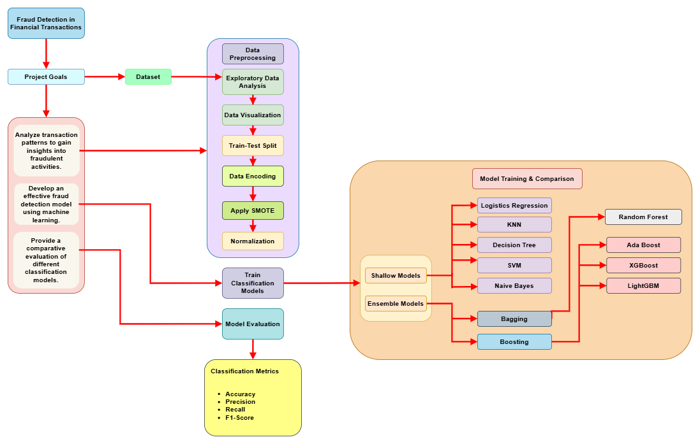

# 💳 Transaction Fraud Detection

This project implements a machine learning system for detecting fraudulent transactions in financial data. The system uses various ML models to identify potentially fraudulent transactions based on multiple features and patterns.

## 📋 Overview

The project analyzes transaction data with features including:
- 💰 Transaction amount and type
- 👤 User information
- 📱 Device and location data
- 📊 Transaction patterns and history
- 🔐 Authentication methods
- ⚠️ Risk scores

## 🔄 Methodology

Our fraud detection system follows a comprehensive methodology that combines data preprocessing, feature engineering, and advanced machine learning techniques. The process flow is illustrated below:



The methodology consists of the following key steps:

1. **📥 Data Collection and Preprocessing**
   - Loading and cleaning transaction data
   - Handling missing values and outliers
   - Feature scaling and normalization

2. **⚙️ Feature Engineering**
   - Creating derived features from transaction patterns
   - Encoding categorical variables
   - Calculating risk scores and behavioral metrics

3. **🤖 Model Development**
   - Training multiple machine learning models
   - Implementing ensemble methods
   - Handling class imbalance using SMOTE

4. **📈 Model Evaluation and Selection**
   - Cross-validation and performance metrics
   - Model comparison and selection
   - Hyperparameter tuning

5. **🚀 Deployment and Monitoring**
   - Model deployment for real-time predictions
   - Continuous monitoring and updates
   - Performance tracking and maintenance

## 📦 Requirements

The project requires the following Python packages:
```
pandas
numpy
matplotlib
seaborn
scikit-learn
xgboost
lightgbm
imbalanced-learn
```

You can install the required packages using:
```bash
pip install pandas numpy matplotlib seaborn scikit-learn xgboost lightgbm imbalanced-learn
```

## 🛠️ Implementation Details

The implementation includes:

1. **🧹 Data Preprocessing**
   - Feature engineering and scaling
   - Handling imbalanced data using SMOTE
   - Encoding categorical variables

2. **📚 Models Used**
   - Shallow Models:
     - Logistic Regression
     - Decision Trees
     - Random Forest
     - Support Vector Machines
     - K-Nearest Neighbors
     - Naive Bayes
   - Ensemble Models:
     - AdaBoost
     - XGBoost
     - LightGBM

3. **📊 Evaluation Metrics**
   - Accuracy
   - Precision
   - Recall
   - F1-score
   - Classification Reports
   - Confusion Matrices

## 💻 Usage

The main implementation is in the `transaction-fraud-detection.ipynb` notebook, which contains:
1. Data loading and exploration
2. Feature preprocessing and engineering
3. Model training and evaluation
4. Performance comparison of different models

## 🔍 Features Used

The model considers various features for fraud detection:
- 💰 Transaction_Amount
- 🏷️ Transaction_Type
- 💵 Account_Balance
- 📱 Device_Type
- 📍 Location
- 🏪 Merchant_Category
- 📊 Daily_Transaction_Count
- 📏 Transaction_Distance
- 🔐 Authentication_Method
- ⚠️ Risk_Score
- And more...

## 📈 Model Evaluation

The models are evaluated using various metrics with a focus on:
- ✅ Identifying fraudulent transactions accurately
- ❌ Minimizing false positives
- 🎯 Maintaining high recall for fraud cases

## 📄 License

This project is open source and available for use and modification.